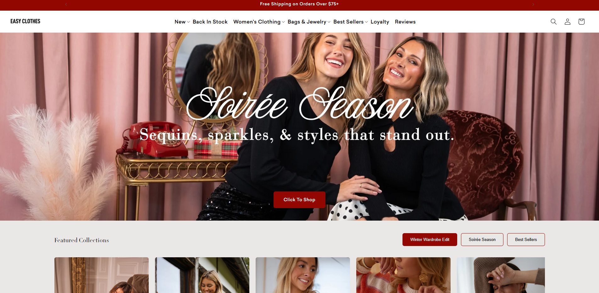

# Easy Clothes - Shopify Theme

A modern, responsive Shopify theme for [Easy Clothes](https://easy-clothes.us/), a North American fashion retailer specializing in women's clothing, bags, and jewelry.



## Overview

This is a custom Shopify theme built on the Dawn theme framework (v15.0.0), tailored for Easy Clothes' e-commerce platform. The theme provides a seamless shopping experience with modern design, responsive layouts, and optimized performance.

## Features

### 🛍️ E-Commerce Features
- **Product Catalog**: Full product browsing with collections, filters, and search
- **Shopping Cart**: Drawer-style cart with real-time updates
- **Quick Add**: Bulk quick-add functionality for faster shopping
- **Product Variants**: Color swatches, size pickers, and variant selection
- **Wishlist Integration**: iWish app integration for wishlist functionality
- **Loyalty Program**: Built-in loyalty and referral system support

### 🎨 Design & UX
- **Responsive Design**: Mobile-first approach for all devices
- **Modern UI Components**: 
  - Mega menu navigation
  - Image galleries with zoom
  - Product modals
  - Newsletter signup banners
  - Countdown timers for promotions
- **Custom Sections**: 
  - Featured products
  - Blog posts
  - Image banners
  - Multi-column layouts
  - Rich text sections

### 🚀 Performance
- **Optimized Assets**: Minified CSS and JavaScript
- **Lazy Loading**: Deferred media loading
- **Fast Navigation**: Smooth page transitions
- **Search Functionality**: Predictive search with instant results

### 🌍 Internationalization
- **Multi-language Support**: 52 locale files included
- **Currency Conversion**: Support for multiple currencies
- **Localization Forms**: Country/region selector

## Project Structure

```
shopify-clothes/
├── assets/              # CSS, JavaScript, and image files
│   ├── Home.png        # Homepage screenshot
│   ├── *.css           # Component and section styles
│   └── *.js            # JavaScript functionality
├── config/             # Theme configuration
│   ├── settings_data.json
│   └── settings_schema.json
├── layout/             # Theme layouts
│   ├── theme.liquid
│   └── password.liquid
├── locales/            # Translation files (52 languages)
├── sections/           # Reusable theme sections (57 files)
├── snippets/           # Reusable code snippets (76 files)
└── templates/          # Page templates
    ├── index.json
    ├── product.json
    ├── collection.json
    └── customers/      # Customer account templates
```

## Key Components

### Sections
- **Featured Product**: Highlight specific products
- **Image Banner**: Promotional banners with CTA
- **Newsletter**: Email signup integration
- **Blog Posts**: Blog article listings
- **Collection List**: Showcase product collections
- **Multicolumn**: Flexible multi-column layouts
- **Rich Text**: Customizable text content

### JavaScript Features
- Cart drawer and notifications
- Product form handling
- Predictive search
- Media gallery with zoom
- Quick add functionality
- Quantity popover
- Pickup availability
- Model viewer for 3D products

## Setup & Installation

### Prerequisites
- Shopify CLI installed
- Access to a Shopify store
- Node.js (for local development)

### Installation Steps

1. **Clone the repository**
   ```bash
   git clone <repository-url>
   cd shopify-clothes
   ```

2. **Install Shopify CLI** (if not already installed)
   ```bash
   npm install -g @shopify/cli @shopify/theme
   ```

3. **Login to Shopify**
   ```bash
   shopify login
   ```

4. **Push theme to your store**
   ```bash
   shopify theme push
   ```

5. **Start development server** (for local development)
   ```bash
   shopify theme dev
   ```

### Theme Customization

The theme can be customized through:
- **Theme Customizer**: Access via Shopify Admin → Online Store → Themes → Customize
- **Settings Schema**: Modify `config/settings_schema.json` for theme settings
- **Liquid Templates**: Edit files in `sections/`, `snippets/`, and `templates/`
- **Assets**: Update CSS and JavaScript in `assets/`

## Technologies Used

- **Liquid**: Shopify's templating language
- **JavaScript (ES6+)**: Modern JavaScript for interactivity
- **CSS3**: Custom styling and animations
- **Shopify Theme API**: Theme development framework
- **Dawn Theme Base**: Built on Shopify's Dawn theme (v15.0.0)

## Live Site

🌐 **Website**: [https://easy-clothes.us/](https://easy-clothes.us/)

## Features Highlights

- ✅ Free shipping on orders over $75+
- ✅ International shipping on orders $200+
- ✅ Loyalty program integration
- ✅ Mobile-responsive design
- ✅ SEO optimized
- ✅ Fast page load times
- ✅ Accessibility compliant

## Support

For theme support and customization:
- **Store**: [Easy Clothes](https://easy-clothes.us/)
- **Support Email**: support@easy-clothes.us
- **Shopify Theme Documentation**: [Shopify Theme Docs](https://shopify.dev/themes)

## License

This theme is proprietary and belongs to Easy Clothes. All rights reserved.

---

**Built with ❤️ for Easy Clothes**

